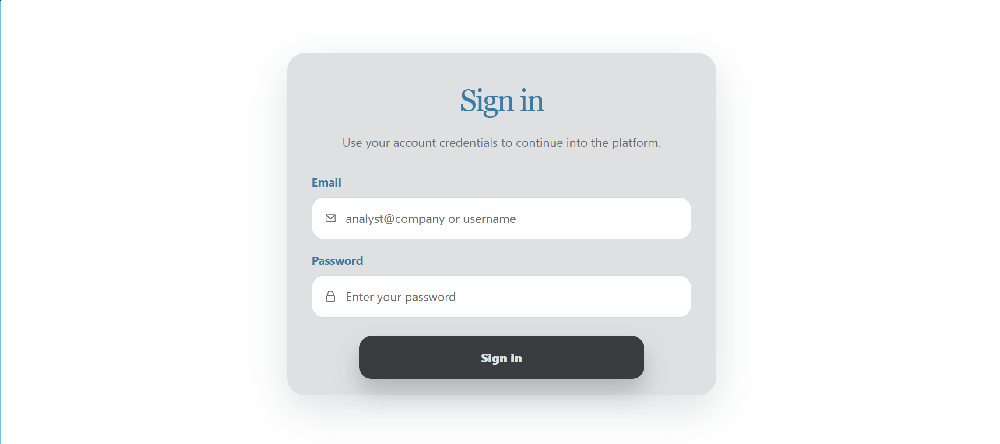
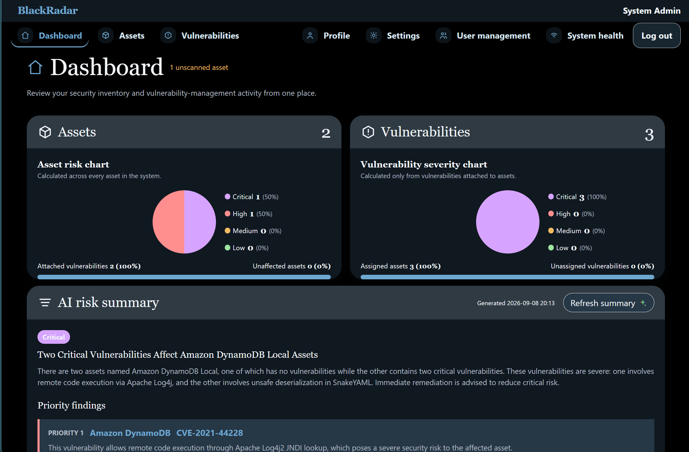
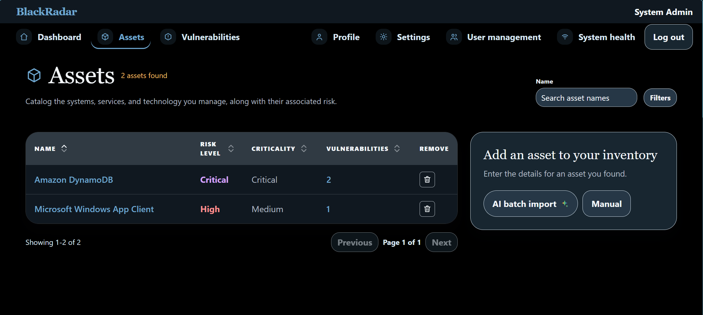
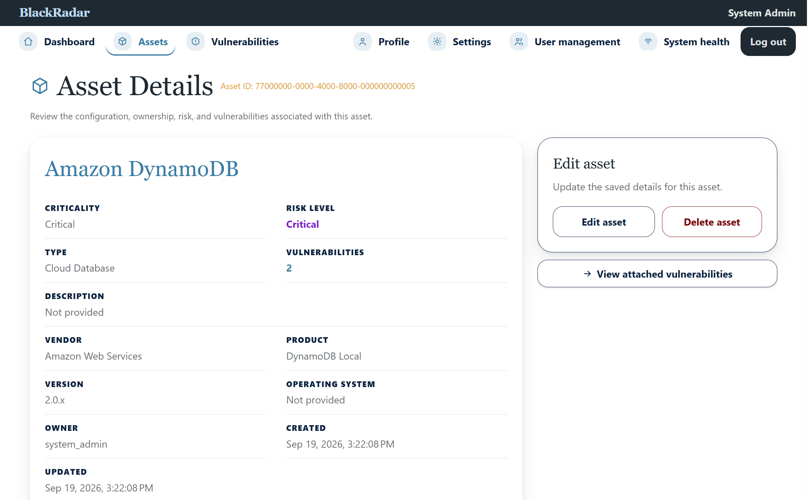
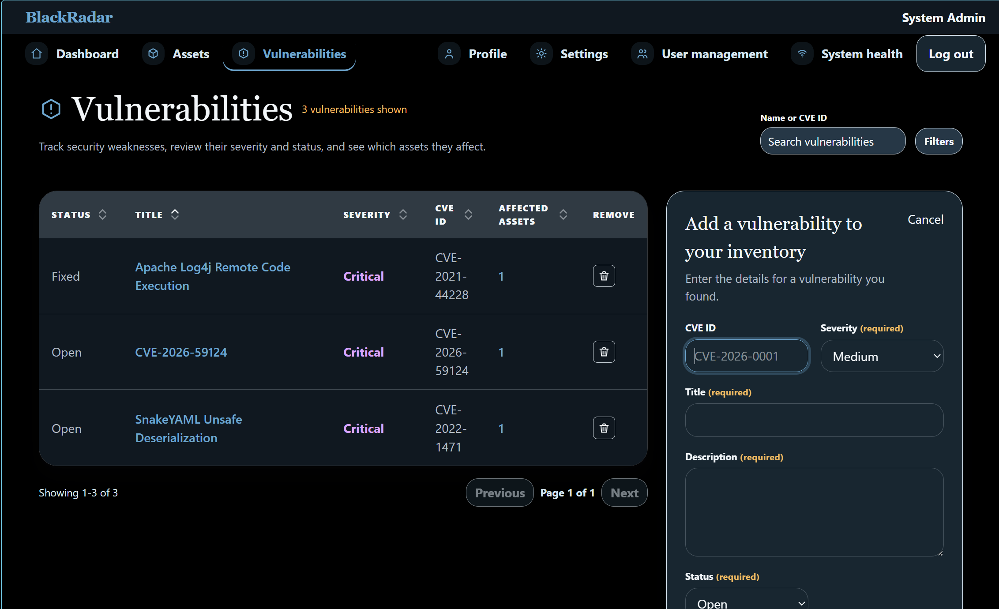
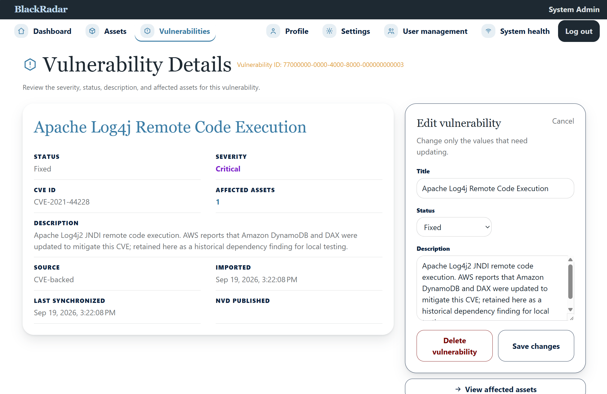
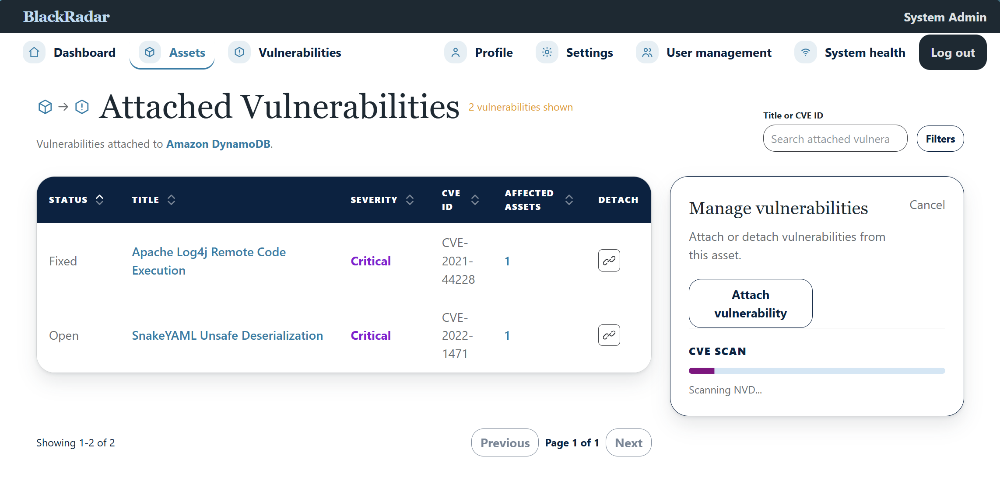
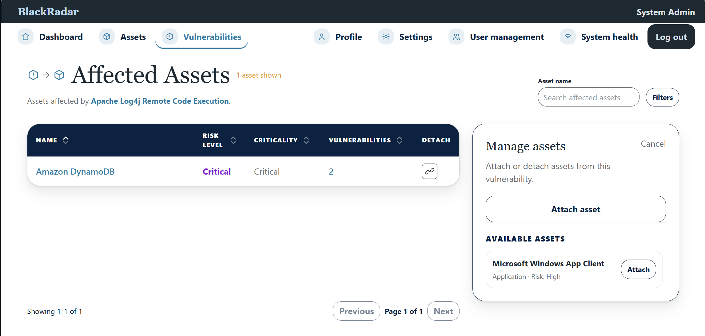

# BlackRadar Security Platform

BlackRadar is a security-focused asset-risk platform for tracking assets, CVEs, and the relationships that make a vulnerability relevant to a specific asset.

It keeps ownership, authorization, risk calculation, NVD access, and AI-assisted matching in the backend rather than trusting the browser.

## What works today

- Create, edit, and manage organization-scoped assets and vulnerabilities.
- Attach and remove vulnerabilities from assets, with asset risk recalculated from active assignments.
- Browse attached vulnerabilities for an asset and affected assets for a vulnerability.
- Browse the asset inventory through server-side pagination with filtering, sorting, and total-count metadata.
- Scan an asset's product identity for NVD CPE candidates, approve a CPE, and attach bounded NVD CVE results.
- Reuse existing CVE records and restore a previously removed asset-vulnerability relationship when an approved scan finds it again.
- Persist NVD publication timestamps for imported CVEs and show them in vulnerability details.
- Enforce backend authentication, ownership, administrator-only management actions, input validation, rate limiting, and transaction boundaries.

## Who, what, when, where, why, and how

- **Who:** Users in the organization share the same assets and vulnerabilities; administrator-only actions still control privileged management workflows.
- **What:** BlackRadar records assets, local vulnerability data, and the active relationships between them.
- **When:** Use it when you need to understand which known vulnerabilities affect a product and how they change an asset's risk.
- **Why:** A CVE record alone does not indicate exposure. The asset-vulnerability relationship makes the risk specific and actionable.
- **How:** The backend validates ownership, retrieves NVD data when an administrator approves a CPE scan, persists the result locally, and recalculates risk.

## Quick start

Requirements:

- Docker Desktop

1. Create a local environment file.

   ```powershell
    .env
   ```

   The template contains only local placeholders:

   ```dotenv
   GO_ENV=development

   POSTGRES_DB=blackradar
   POSTGRES_USER=blackradar
   POSTGRES_PASSWORD=replace-with-a-local-db-password

   # Must be a unique local-only value with at least 32 characters.
   JWT_SECRET=replace-with-a-local-jwt-secret-at-least-32-characters

   BOOTSTRAP_DEV_DATA=true
   BOOTSTRAP_DEV_PASSWORD=replace-with-a-local-bootstrap-password

   # Optional provider credentials. Keep these server-side.
   NVD_API_KEY=
   OPENAI_API_KEY=
   ```

2. In `.env`, replace `JWT_SECRET` and `BOOTSTRAP_DEV_PASSWORD` with unique local-only values. `JWT_SECRET` must be at least 32 characters. Do not commit `.env`.

3. Start the stack.

   ```bash
   docker compose up --build
   ```

4. Open the application at `http://localhost:4200`. The backend is available at `http://localhost:8080`.

The frontend service installs its dependencies during startup, so the first run can take a little longer. PostgreSQL stays inside the Compose network and is not published to the host.

### Optional local bootstrap data

The example environment file enables a local-only bootstrap account and sample asset. It is allowed only in `local`, `development`, and `test` environments. Sign in as `system_admin` with the value you set for `BOOTSTRAP_DEV_PASSWORD`. To disable it, set `BOOTSTRAP_DEV_DATA=false` before starting Compose.

NVD and OpenAI keys are optional local configuration values. Keep both in `.env`; the browser never receives them.

## How it is structured

```text
Angular frontend
       |
       v
Go API (authentication, authorization, matching, risk)
       |
       +--> PostgreSQL
       +--> NVD APIs
       `--> OpenAI API
```

The Go backend is the trust boundary. The Angular application handles user interaction and renders backend responses, but it does not make authorization decisions, calculate authoritative risk, or call NVD and OpenAI directly.

The backend uses a controller -> service -> repository flow. Services coordinate transactions and external providers; repositories own PostgreSQL access. Imported CVEs are persisted locally so normal application reads do not depend on live NVD responses.

## Project layout

```text
AssetManagementRisk/
|-- BlackRadar/              Go backend and feature documentation
|   |-- api/                 Controllers, services, repositories, models, platform code
|   |-- docs/                Feature and operational documentation
|   `-- ui/                  Angular application
|-- docker-compose.yml       Local PostgreSQL, backend, and frontend stack
|-- .env                     Safe local configuration
`-- AGENTS.md                Repository instructions for coding agents
```

## Main API areas

| Area             | Current endpoints                                                                                        |
| ---------------- | -------------------------------------------------------------------------------------------------------- |
| Authentication   | `POST /api/auth/login`, `POST /api/auth/refresh`, `POST /api/auth/logout`                                |
| Dashboard        | Uses `GET /api/assets/summary` and `GET /api/vulnerabilities` for the current overview                  |
| Assets           | `GET /api/assets?page=1`, `GET /api/assets/summary`, `POST /api/assets`; `GET`, `PUT`, `DELETE /api/assets/{id}` |
| Vulnerabilities  | `GET`, `POST /api/vulnerabilities`; `GET`, `PUT`, `DELETE /api/vulnerabilities/{id}`                     |
| Relationships    | `GET /api/assets/{id}/vulnerabilities`; `GET /api/vulnerabilities/{id}/assets`; assign and remove routes |
| CPE/CVE matching | `POST /api/assets/{id}/match-cpe/preview`; `POST /api/assets/{id}/match-cpe/vulnerabilities/apply`       |
| NVD lookup       | `GET /api/nvd/cves/{cveId}`                                                                              |

## Interface walkthrough

### Sign in



### Dashboard



### Assets





### Vulnerabilities





### Asset-vulnerability relationships





See [asset-vulnerability-assignment.md](BlackRadar/docs/asset-vulnerability-assignment.md) and [ai-cpe-and-cve-matching.md](BlackRadar/docs/ai-cpe-and-cve-matching.md) for workflow details and route behavior.

## Security model

- Assets and vulnerabilities are scoped to the authenticated user.
- Privileged vulnerability-management actions are enforced by the backend.
- Provider credentials, database credentials, and session secrets remain server-side.
- Browser input, NVD data, AI output, and route parameters are validated before use.
- Asset-risk updates and relationship writes share transaction boundaries.
- Core records and asset-vulnerability relationships use soft-delete behavior where recovery and history matter.

Read [security-boundaries.md](BlackRadar/docs/security-boundaries.md) for the full trust-boundary and error-handling model.

## Development checks

Run backend checks from `BlackRadar/` and frontend checks from `BlackRadar/ui/`:

```powershell
cd BlackRadar
go test ./...

cd ui
npm run test -- --watch=false
```

For focused feature work, run the smallest relevant test package or component spec first.

## Documentation

- [NVD integration](BlackRadar/docs/nvd-integration.md)
- [Asset-vulnerability assignment](BlackRadar/docs/asset-vulnerability-assignment.md)
- [CPE and CVE matching](BlackRadar/docs/ai-cpe-and-cve-matching.md)
- [Asset risk](BlackRadar/docs/asset-risk.md)
- [Frontend architecture](BlackRadar/docs/frontend-angular.md)
- [Pagination](BlackRadar/docs/pagination.md)
- [Infrastructure](BlackRadar/docs/infrastructure.md)

## Concepts

- **Asset:** A tracked product, device, application, or service.
- **Vulnerability:** A locally stored security issue, optionally identified by a CVE.
- **CVE:** A standardized identifier for a publicly disclosed vulnerability.
- **CPE:** A standardized product identifier used to find relevant NVD CVEs.
- **NVD:** The National Vulnerability Database, the external CVE and CPE data source.
- **Active assignment:** A current link between one asset and one vulnerability; only active assignments affect risk.
- **Affected asset:** An asset with an active assignment to a vulnerability.
- **Asset risk:** A backend-derived level based on asset criticality and the highest severity among its active vulnerabilities.
## Next up

- Human CPE-review improvements and batch asset ingestion.
- CVE synchronization and alerting for changed vulnerability data.
- Remediation workflows, exceptions, and work orders.
- Dashboard analytics and risk trends.
- Production deployment hardening, including TLS, managed secrets, and cloud runtime controls.
